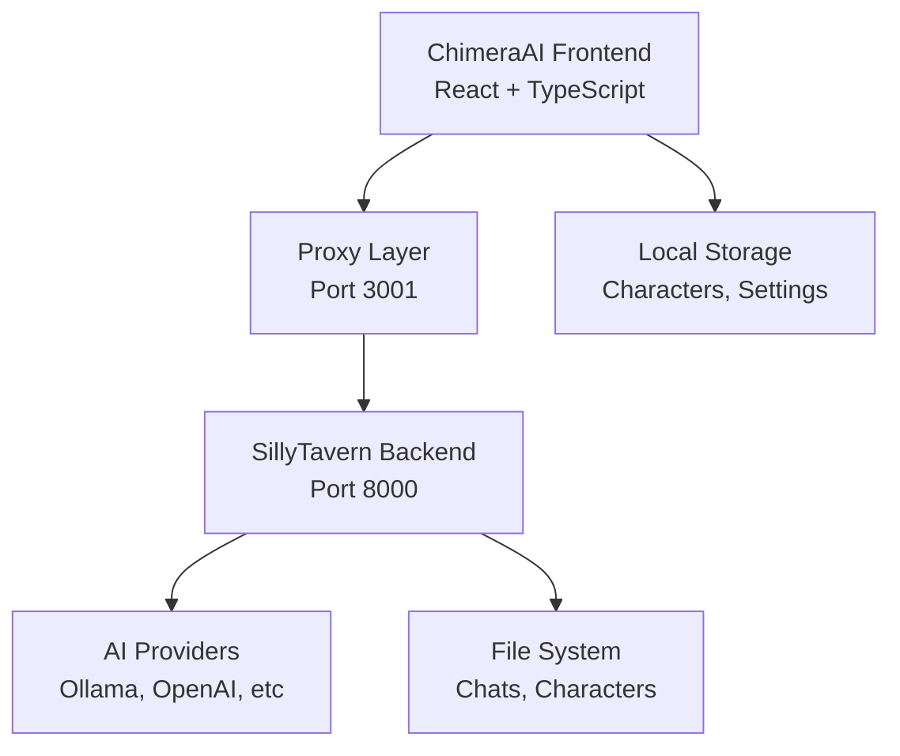

# ChimeraAI Documentation


**ChimeraAI** adalah interface chat AI modern yang dibangun dengan teknologi terdepan, menggabungkan desain intuitif ala ChatGPT/Gemini dengan kekuatan backend SillyTavern.

## 📚 Struktur Dokumentasi

```
docs/
├── README.md                    # Overview umum (file ini)
├── phase1/                      # Dokumentasi Phase 1 (Complete)
│   ├── overview.md             # Ringkasan fitur Phase 1
│   ├── installation.md         # Panduan instalasi & setup
│   ├── user-guide.md          # Panduan penggunaan
│   ├── technical-specs.md     # Spesifikasi teknis
│   └── api-reference.md       # Referensi API
├── phase2/                      # Planning Phase 2 (Coming Soon)
│   ├── roadmap.md             # Roadmap pengembangan
│   ├── features.md            # Fitur yang akan ditambahkan
│   └── integration-plan.md    # Rencana integrasi backend
└── assets/                      # Asset dokumentasi
    ├── screenshots/           # Screenshot aplikasi
    └── diagrams/             # Diagram arsitektur
```

## 🚀 Quick Start

### Phase 1 - Current Release
- ✅ **Status**: Complete & Ready for Testing
- 🎨 **UI/UX**: Modern interface dengan light/dark mode
- 🖥️ **Frontend**: http://localhost:3001
- 🔧 **Backend**: http://localhost:8000 (SillyTavern)

**Lihat**: [Phase 1 User Guide](./phase1/user-guide.md)

### Phase 2 - Coming Next
- 🔄 **Status**: Planning & Design
- 🌐 **Focus**: Full API Integration & Advanced Features
- 🤖 **Goal**: Production-ready AI chat platform

**Lihat**: [Phase 2 Roadmap](./phase2/roadmap.md)

## 🏗️ Arsitektur Sistem



## 📖 Panduan Penggunaan Cepat

1. **Start Development Server**:
   ```bash
   cd /app/ChimeraDev
   yarn dev
   ```

2. **Access ChimeraAI**: http://localhost:3001

3. **Mulai Chat**: 
   - Klik "Start Chatting" 
   - Pilih character (Aria/Nova)
   - Mulai conversation!

## 🔧 Development Info

- **Tech Stack**: React 19 + TypeScript + Tailwind CSS v3
- **State Management**: Zustand
- **Icons**: Lucide React
- **HTTP Client**: Axios
- **Build Tool**: Vite

## 📞 Support & Resources

- **Documentation**: [Phase 1 Technical Specs](./phase1/technical-specs.md)
- **API Reference**: [API Documentation](./phase1/api-reference.md)
- **Issue Tracking**: Coming in Phase 2
- **Feature Requests**: Document dalam Phase 2 planning

---

**Last Updated**: Phase 1 - December 2024  
**Next Release**: Phase 2 - TBA