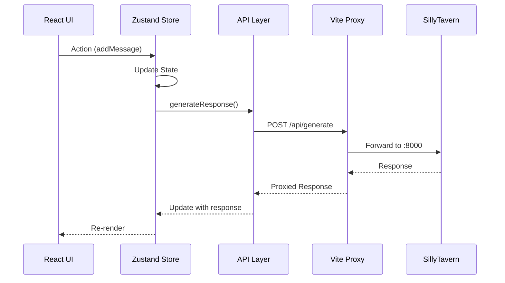

# API Reference - Phase 1

## 📡 API Overview

ChimeraAI Phase 1 menggunakan **dual-layer API architecture**:
1. **Internal API**: Frontend ↔ Zustand Store (Client-side)
2. **External API**: ChimeraAI ↔ SillyTavern Backend (Server-side)

## 🏗️ API Architecture



## 🔧 Internal API (Frontend)

### Zustand Store Actions

#### Chat Management
```typescript
// Create new chat with character
createNewChat: (characterId: string) => void

// Select existing chat
selectChat: (chatId: string) => void

// Clear current chat
clearCurrentChat: () => void

// Export chat to JSON
exportChat: (chatId: string) => string
```

#### Message Management  
```typescript
// Add message to current chat
addMessage: (message: Omit<IChatMessage, 'id' | 'timestamp'>) => void

// Update existing message
updateMessage: (messageId: string, updates: Partial<IChatMessage>) => void

// Delete message
deleteMessage: (messageId: string) => void
```

#### Character Management
```typescript
// Set active character
setCurrentCharacter: (character: ICharacter) => void

// Add new character
addCharacter: (character: ICharacter) => void
```

#### UI State Management
```typescript
// Theme controls
setTheme: (theme: 'light' | 'dark') => void

// Sidebar controls
toggleSidebar: () => void
toggleSettingsPanel: () => void

// Generation state
setGenerating: (isGenerating: boolean) => void
```

#### Settings Management
```typescript
// Update model settings
updateModelSettings: (settings: Partial<IModelSettings>) => void

// Set active API connection
setActiveConnection: (connection: IAPIConnection) => void
```

### Store State Structure
```typescript
interface ChatStore {
  // Current state
  current_chat_id: string | null;
  current_character: ICharacter | null;
  messages: IChatMessage[];
  
  // Collections
  chats: IChat[];
  characters: ICharacter[];
  connections: IAPIConnection[];
  
  // UI state
  is_generating: boolean;
  is_sidebar_open: boolean;
  is_settings_panel_open: boolean;
  theme: 'light' | 'dark';
  
  // Configuration
  model_settings: IModelSettings;
  active_connection: IAPIConnection | null;
}
```

## 🌐 External API (Backend Integration)

### Base Configuration
```typescript
// API Client Setup
const apiClient = axios.create({
  baseURL: '/api',              // Proxied to SillyTavern
  timeout: 60000,               // 60 second timeout
  headers: {
    'Content-Type': 'application/json'
  }
});
```

### Chat API Endpoints

#### Generate Response
```typescript
POST /api/generate
```

**Request Body**:
```typescript
interface ChatCompletionRequest {
  messages: Array<{
    role: 'system' | 'user' | 'assistant';
    content: string;
    name?: string;
  }>;
  character?: ICharacter;
  settings: IModelSettings;
  stream?: boolean;
}
```

**Response**:
```typescript
interface GenerateResponse {
  text: string;
  finish_reason?: string;
  usage?: {
    prompt_tokens: number;
    completion_tokens: number;
    total_tokens: number;
  };
}
```

**Example Usage**:
```typescript
const response = await generateResponse({
  messages: [
    { role: 'system', content: 'You are Aria, a helpful assistant.' },
    { role: 'user', content: 'Hello!' }
  ],
  character: currentCharacter,
  settings: {
    temperature: 0.7,
    max_tokens: 1024,
    top_p: 1.0,
    frequency_penalty: 0,
    presence_penalty: 0,
    model: 'llama3.2',
    provider: 'ollama',
    streaming: true
  }
});
```

#### Model Management
```typescript
GET /api/models/{provider}
```

**Parameters**:
- `provider`: AI provider name (ollama, openai, etc.)

**Response**:
```typescript
{
  success: boolean;
  data: string[];  // Array of available models
}
```

**Example**:
```typescript
const models = await getAvailableModels('ollama');
// Response: ["llama3.2", "codellama", "mistral", ...]
```

#### Connection Testing
```typescript
POST /api/test-connection
```

**Request Body**:
```typescript
{
  provider: string;
  endpoint?: string;
  apiKey?: string;
}
```

**Response**:
```typescript
{
  success: boolean;
  data: {
    status: string;
    models?: string[];
  };
}
```

### Character API Endpoints

#### Get Characters
```typescript
GET /api/characters
```

**Response**:
```typescript
{
  success: boolean;
  data: ICharacter[];
}
```

#### Create Character
```typescript
POST /api/characters
```

**Request Body**:
```typescript
Omit<ICharacter, 'id' | 'created_at' | 'updated_at'>
```

**Response**:
```typescript
{
  success: boolean;
  data: ICharacter;
}
```

#### Update Character
```typescript
PUT /api/characters/{id}
```

**Request Body**:
```typescript
Partial<ICharacter>
```

#### Delete Character
```typescript
DELETE /api/characters/{id}
```

#### Upload Avatar
```typescript
POST /api/characters/{id}/avatar
```

**Request**: FormData with 'avatar' file

**Response**:
```typescript
{
  success: boolean;
  data: { avatar_url: string };
}
```

## 🔌 Proxy Configuration

### Vite Development Proxy
```typescript
// vite.config.ts
server: {
  proxy: {
    '/api': {
      target: 'http://localhost:8000',    // SillyTavern backend
      changeOrigin: true,
      secure: false,
      rewrite: (path) => path             // Keep /api prefix
    }
  }
}
```

### Request Flow
```
Frontend Request: http://localhost:3001/api/generate
         ↓
Vite Proxy: Forwards to http://localhost:8000/api/generate  
         ↓
SillyTavern: Processes request
         ↓
Response: Returned through proxy chain
```

## 🛠️ Utility Functions

### API Call Wrapper
```typescript
// Generic API wrapper with error handling
async function apiCall<T>(
  method: 'GET' | 'POST' | 'PUT' | 'DELETE',
  endpoint: string,
  data?: any
): Promise<APIResponse<T>> {
  try {
    const response = await apiClient.request({
      method,
      url: endpoint,
      data
    });
    
    return {
      success: true,
      data: response.data
    };
  } catch (error: any) {
    return {
      success: false,
      error: error.response?.data?.message || error.message
    };
  }
}
```

### Message Formatting
```typescript
// Convert chat messages to API format
function messagesToApiFormat(
  messages: IChatMessage[], 
  character?: ICharacter
) {
  const apiMessages = messages.map(msg => ({
    role: msg.sender === 'user' ? 'user' as const : 'assistant' as const,
    content: msg.text,
    name: msg.name
  }));
  
  if (character) {
    const systemMessage = {
      role: 'system' as const,
      content: `You are ${character.name}. ${character.description}\n\nPersonality: ${character.personality}\n\nScenario: ${character.scenario}`
    };
    return [systemMessage, ...apiMessages];
  }
  
  return apiMessages;
}
```

### Token Estimation
```typescript
// Rough token count estimation
function estimateTokenCount(text: string): number {
  // Approximation: 1 token ≈ 0.75 words
  const words = text.split(/\s+/).length;
  return Math.ceil(words * 1.3);
}
```

## 📊 Phase 1 API Status

### ✅ Implemented (Functional)
- **Store Management**: Full CRUD operations
- **State Persistence**: LocalStorage integration  
- **Theme API**: Light/dark mode switching
- **UI State API**: Sidebar, panel controls
- **Message API**: Add, update, delete messages
- **Character API**: Basic character management
- **Settings API**: Model parameter controls

### 🟡 Partially Implemented (UI Ready)
- **Generate API**: UI ready, responses simulated
- **File Upload API**: UI ready, no backend integration
- **Voice API**: UI ready, no functionality
- **Streaming API**: UI ready, websocket pending

### ❌ Not Implemented (Phase 2)
- **Real AI Integration**: Full SillyTavern API connection
- **Authentication API**: User management
- **Extensions API**: Quick Reply, World Info, Token Counter  
- **Export/Import API**: Chat backup/restore
- **Search API**: Chat and message search

## 🔍 Error Handling

### API Error Types
```typescript
interface APIError {
  success: false;
  error: string;
  code?: number;
  details?: any;
}
```

### Error Response Examples
```typescript
// Network error
{
  success: false,
  error: "Network error occurred",
  code: 500
}

// Validation error  
{
  success: false,
  error: "Invalid character data",
  code: 400,
  details: ["name is required", "description too short"]
}

// Authentication error
{
  success: false,
  error: "Unauthorized access", 
  code: 401
}
```

### Error Handling Strategy
```typescript
// In components
const handleApiCall = async () => {
  try {
    const response = await generateResponse(request);
    
    if (response.success) {
      // Handle success
      addMessage({
        sender: 'character',
        name: character.name,
        text: response.data.text,
        is_regenerated: false
      });
    } else {
      // Handle API error
      console.error('API Error:', response.error);
      // Show user-friendly error message
    }
  } catch (error) {
    // Handle network/unexpected errors
    console.error('Network Error:', error);
    // Fallback behavior
  }
};
```

## 🚀 Phase 2 API Roadmap

### Planned Enhancements
1. **Real-time Streaming**: WebSocket integration
2. **Authentication System**: User accounts & sessions
3. **Advanced Character API**: Templates, sharing, marketplace
4. **Extension API**: Plugin system for custom functionality
5. **Search & Filter API**: Advanced chat/message querying
6. **Analytics API**: Usage statistics & insights
7. **Export/Import API**: Data portability & backups

### Breaking Changes (Phase 2)
- **Authentication Required**: Protected endpoints
- **Rate Limiting**: API quotas & throttling  
- **Versioned API**: `/api/v1/` prefix
- **Enhanced Error Responses**: Structured error codes

---

**Current API Version**: Phase 1 (Development)  
**Next Version**: Phase 2 (Production Ready)