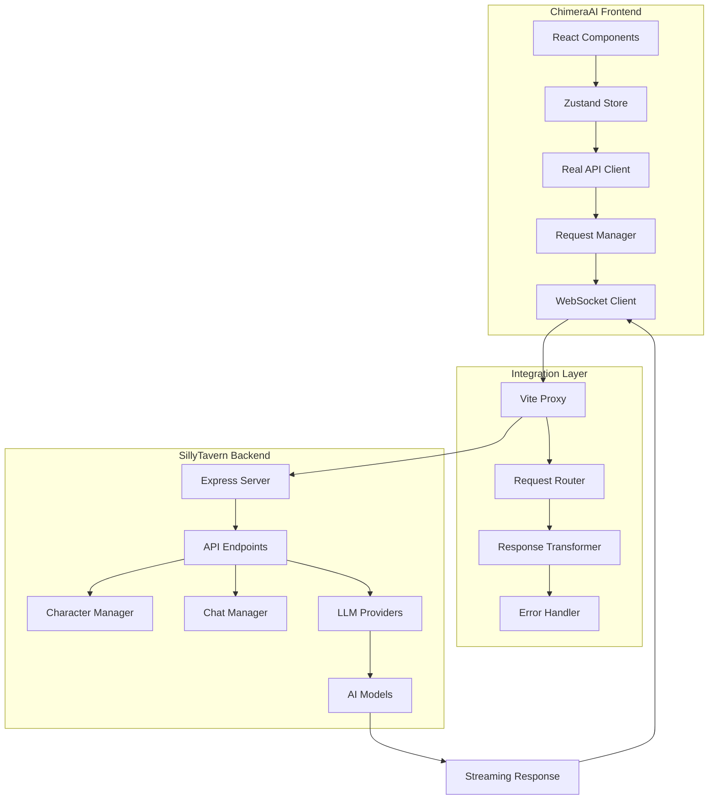

# Phase 2 - Integration Plan

## 🎯 Integration Strategy Overview

Phase 2 integration plan fokus pada **seamless connection** antara ChimeraAI frontend dengan SillyTavern backend, sambil mempertahankan **modern UI/UX** yang sudah dibangun di Phase 1.

## 🏗️ Architecture Integration

### Current Architecture (Phase 1)
```mermaid
graph TB
    subgraph "ChimeraAI Frontend"
        A[React Components] --> B[Zustand Store]
        B --> C[Simulated API Calls]
        C --> D[Mock Responses]
    end
    
    subgraph "SillyTavern Backend"
        E[Express Server] --> F[API Endpoints]
        F --> G[LLM Providers]
        G --> H[AI Models]
    end
    
    A -.-> I[Proxy (Unused)]
    I -.-> E
```

### Target Architecture (Phase 2)


## 📡 API Integration Plan

### Phase 1 → Phase 2 Migration

#### 1. Message Generation Integration
**Phase 1 (Current)**:
```typescript
// Simulated response
const handleSubmit = async () => {
  setGenerating(true);
  setTimeout(() => {
    addMessage({
      sender: 'character',
      name: character.name,
      text: `Simulated response from ${character.name}`,
      is_regenerated: false
    });
    setGenerating(false);
  }, 1500);
};
```

**Phase 2 (Target)**:
```typescript
// Real API integration
const handleSubmit = async () => {
  setGenerating(true);
  
  try {
    const apiMessages = messagesToApiFormat(messages, character);
    
    if (model_settings.streaming) {
      // Real-time streaming
      const stream = await streamResponse({
        messages: apiMessages,
        character,
        settings: model_settings
      });
      
      let accumulatedText = '';
      for await (const token of stream) {
        accumulatedText += token;
        // Update message in real-time
        updatePartialMessage(accumulatedText);
      }
      
      // Finalize message
      finalizeMessage(accumulatedText);
    } else {
      // Single response
      const response = await generateResponse({
        messages: apiMessages,
        character,
        settings: model_settings
      });
      
      addMessage({
        sender: 'character',
        name: character.name,
        text: response.data.text,
        is_regenerated: false,
        metadata: {
          token_count: response.data.usage?.total_tokens
        }
      });
    }
  } catch (error) {
    handleGenerationError(error);
  } finally {
    setGenerating(false);
  }
};
```

#### 2. Character Loading Integration
**Phase 1 (Current)**:
```typescript
// Pre-loaded static characters
const sampleCharacters: ICharacter[] = [
  { id: 'aria', name: 'Aria', /* ... */ },
  { id: 'nova', name: 'Nova', /* ... */ }
];
```

**Phase 2 (Target)**:
```typescript
// Dynamic character loading dari SillyTavern
const loadCharacters = async (): Promise<ICharacter[]> => {
  try {
    const response = await apiCall<any[]>('GET', '/characters');
    
    if (response.success && response.data) {
      return response.data.map(stCharacter => ({
        id: stCharacter.char_filename,
        name: stCharacter.char_name,
        description: stCharacter.char_persona || stCharacter.description,
        personality: stCharacter.char_personality || '',
        scenario: stCharacter.char_scenario || '',
        first_message: stCharacter.char_greeting || stCharacter.first_mes,
        avatar_url: stCharacter.avatar || `/characters/${stCharacter.char_filename}.png`,
        created_at: stCharacter.create_date || new Date().toISOString(),
        updated_at: stCharacter.date_last_chat || new Date().toISOString()
      }));
    }
    
    return [];
  } catch (error) {
    console.error('Failed to load characters:', error);
    return [];
  }
};
```

#### 3. Settings Synchronization
**Phase 1 (Current)**:
```typescript
// Local-only settings
const updateModelSettings = (settings: Partial<IModelSettings>) => {
  set((state) => ({
    model_settings: { ...state.model_settings, ...settings }
  }));
};
```

**Phase 2 (Target)**:
```typescript
// Bi-directional settings sync
const updateModelSettings = async (settings: Partial<IModelSettings>) => {
  // Update local state immediately (optimistic)
  set((state) => ({
    model_settings: { ...state.model_settings, ...settings }
  }));
  
  // Sync dengan backend
  try {
    await apiCall('POST', '/settings/model', {
      ...get().model_settings,
      ...settings
    });
  } catch (error) {
    // Revert pada error
    console.error('Failed to sync settings:', error);
    // Could implement retry logic here
  }
};
```

## 🔌 SillyTavern API Endpoints Integration

### Core Endpoints to Integrate

#### 1. Chat & Message Management
```typescript
// SillyTavern API endpoints yang akan digunakan
const ENDPOINTS = {
  // Chat management
  GENERATE: '/api/generate',
  CHAT_COMPLETIONS: '/api/openai/v1/chat/completions',
  
  // Character management  
  CHARACTERS: '/api/characters',
  CHARACTER_INFO: '/api/character/info',
  CHARACTER_CHAT: '/api/character/chat',
  
  // Settings
  SETTINGS: '/api/settings',
  PRESETS: '/api/presets',
  
  // File management
  UPLOAD: '/api/upload',
  IMAGES: '/api/images',
  
  // Extensions
  EXTENSIONS: '/api/extensions',
  QUICK_REPLIES: '/api/quick-replies',
  WORLD_INFO: '/api/world-info'
};
```

#### 2. Request/Response Transformation
```typescript
// Transform ChimeraAI requests ke SillyTavern format
class SillyTavernAdapter {
  static transformChatRequest(
    chimeraRequest: ChatCompletionRequest
  ): SillyTavernChatRequest {
    return {
      messages: chimeraRequest.messages.map(msg => ({
        role: msg.role,
        content: msg.content,
        name: msg.name
      })),
      model: chimeraRequest.settings.model,
      temperature: chimeraRequest.settings.temperature,
      max_tokens: chimeraRequest.settings.max_tokens,
      top_p: chimeraRequest.settings.top_p,
      frequency_penalty: chimeraRequest.settings.frequency_penalty,
      presence_penalty: chimeraRequest.settings.presence_penalty,
      stream: chimeraRequest.settings.streaming,
      // Character context
      character_name: chimeraRequest.character?.name,
      personality: chimeraRequest.character?.personality,
      scenario: chimeraRequest.character?.scenario
    };
  }
  
  static transformChatResponse(
    stResponse: SillyTavernResponse
  ): ChimeraResponse {
    return {
      text: stResponse.choices?.[0]?.message?.content || stResponse.output,
      finish_reason: stResponse.choices?.[0]?.finish_reason,
      usage: {
        prompt_tokens: stResponse.usage?.prompt_tokens || 0,
        completion_tokens: stResponse.usage?.completion_tokens || 0,
        total_tokens: stResponse.usage?.total_tokens || 0
      }
    };
  }
}
```

### 3. Streaming Integration
```typescript
// Real-time streaming implementation
class StreamingManager {
  private eventSource: EventSource | null = null;
  
  async streamChatCompletion(
    request: ChatCompletionRequest
  ): AsyncGenerator<string> {
    const transformedRequest = SillyTavernAdapter.transformChatRequest(request);
    
    // Use Server-Sent Events untuk streaming
    const response = await fetch('/api/chat/completions', {
      method: 'POST',
      headers: {
        'Content-Type': 'application/json',
        'Accept': 'text/event-stream'
      },
      body: JSON.stringify({
        ...transformedRequest,
        stream: true
      })
    });
    
    const reader = response.body?.getReader();
    const decoder = new TextDecoder();
    
    if (!reader) throw new Error('Streaming not supported');
    
    try {
      while (true) {
        const { done, value } = await reader.read();
        
        if (done) break;
        
        const chunk = decoder.decode(value);
        const lines = chunk.split('\n').filter(line => line.trim());
        
        for (const line of lines) {
          if (line.startsWith('data: ')) {
            const data = line.slice(6);
            if (data === '[DONE]') return;
            
            try {
              const parsed = JSON.parse(data);
              const content = parsed.choices?.[0]?.delta?.content;
              if (content) yield content;
            } catch (error) {
              console.warn('Failed to parse streaming chunk:', error);
            }
          }
        }
      }
    } finally {
      reader.releaseLock();
    }
  }
}
```

## 🎭 Character System Integration

### Character Loading Strategy
```typescript
class CharacterManager {
  private static readonly CHARACTER_CACHE_KEY = 'chimera_characters_cache';
  private static readonly CACHE_DURATION = 5 * 60 * 1000; // 5 minutes
  
  static async loadCharacters(forceRefresh = false): Promise<ICharacter[]> {
    // Check cache first
    if (!forceRefresh) {
      const cached = this.getCachedCharacters();
      if (cached) return cached;
    }
    
    try {
      // Load dari SillyTavern
      const response = await apiCall<any[]>('GET', '/characters');
      
      if (!response.success) {
        throw new Error(response.error || 'Failed to load characters');
      }
      
      const characters = response.data.map(this.transformCharacter);
      
      // Cache hasil
      this.setCachedCharacters(characters);
      
      return characters;
    } catch (error) {
      console.error('Character loading failed:', error);
      
      // Fallback ke cached data or default characters
      return this.getCachedCharacters() || this.getDefaultCharacters();
    }
  }
  
  private static transformCharacter(stCharacter: any): ICharacter {
    return {
      id: stCharacter.char_filename || generateId(),
      name: stCharacter.char_name || 'Unnamed Character',
      description: stCharacter.char_persona || stCharacter.description || '',
      personality: stCharacter.char_personality || '',
      scenario: stCharacter.char_scenario || '',
      first_message: stCharacter.char_greeting || stCharacter.first_mes || '',
      avatar_url: stCharacter.avatar 
        ? `/characters/${stCharacter.avatar}`
        : this.getDefaultAvatar(stCharacter.char_name),
      created_at: stCharacter.create_date || new Date().toISOString(),
      updated_at: stCharacter.date_last_chat || new Date().toISOString()
    };
  }
  
  static async createCharacter(character: Omit<ICharacter, 'id' | 'created_at' | 'updated_at'>): Promise<ICharacter> {
    const stCharacterData = {
      char_name: character.name,
      char_persona: character.description,
      char_personality: character.personality,
      char_scenario: character.scenario,
      char_greeting: character.first_message,
      avatar: character.avatar_url
    };
    
    const response = await apiCall<any>('POST', '/characters', stCharacterData);
    
    if (!response.success) {
      throw new Error(response.error || 'Failed to create character');
    }
    
    return this.transformCharacter(response.data);
  }
}
```

## ⚙️ Settings Integration Strategy

### 1. Model Settings Synchronization
```typescript
class SettingsSync {
  private static syncInProgress = false;
  
  static async syncModelSettings(settings: IModelSettings): Promise<void> {
    if (this.syncInProgress) return;
    
    this.syncInProgress = true;
    
    try {
      // Map ChimeraAI settings ke SillyTavern format
      const stSettings = {
        model: settings.model,
        temperature: settings.temperature,
        max_tokens: settings.max_tokens,
        top_p: settings.top_p,
        frequency_penalty: settings.frequency_penalty,
        presence_penalty: settings.presence_penalty,
        stream: settings.streaming
      };
      
      // Update backend settings
      await apiCall('POST', '/settings/model', stSettings);
      
      // Update preset jika diperlukan
      if (settings.provider !== 'custom') {
        await this.updatePreset(settings.provider, stSettings);
      }
      
    } catch (error) {
      console.error('Settings sync failed:', error);
      throw error;
    } finally {
      this.syncInProgress = false;
    }
  }
  
  static async loadBackendSettings(): Promise<IModelSettings> {
    try {
      const response = await apiCall<any>('GET', '/settings');
      
      if (response.success) {
        return {
          temperature: response.data.temperature || 0.7,
          max_tokens: response.data.max_tokens || 1024,
          top_p: response.data.top_p || 1.0,
          frequency_penalty: response.data.frequency_penalty || 0,
          presence_penalty: response.data.presence_penalty || 0,
          model: response.data.model || 'default',
          provider: response.data.provider || 'openai',
          streaming: response.data.stream || true
        };
      }
    } catch (error) {
      console.error('Failed to load backend settings:', error);
    }
    
    // Return defaults jika loading gagal
    return {
      temperature: 0.7,
      max_tokens: 1024,
      top_p: 1.0,
      frequency_penalty: 0,
      presence_penalty: 0,
      model: 'gpt-3.5-turbo',
      provider: 'openai',
      streaming: true
    };
  }
}
```

### 2. Connection Management
```typescript
class ConnectionManager {
  private static connections: Map<string, IAPIConnection> = new Map();
  private static activeConnectionId: string | null = null;
  
  static async initializeConnections(): Promise<void> {
    try {
      // Load available connections dari SillyTavern
      const response = await apiCall<any[]>('GET', '/connections');
      
      if (response.success) {
        response.data.forEach(conn => {
          const connection: IAPIConnection = {
            id: conn.id,
            name: conn.name,
            provider: conn.type,
            endpoint_url: conn.endpoint,
            api_key: conn.api_key ? '***masked***' : undefined,
            model: conn.default_model || '',
            is_active: conn.active || false,
            settings: conn.settings || {}
          };
          
          this.connections.set(conn.id, connection);
          
          if (conn.active) {
            this.activeConnectionId = conn.id;
          }
        });
      }
    } catch (error) {
      console.error('Failed to load connections:', error);
      
      // Create default Ollama connection
      this.createDefaultConnection();
    }
  }
  
  static async testConnection(connectionId: string): Promise<boolean> {
    try {
      const response = await apiCall<any>('POST', '/test-connection', {
        connectionId
      });
      
      return response.success && response.data.status === 'connected';
    } catch (error) {
      console.error(`Connection test failed for ${connectionId}:`, error);
      return false;
    }
  }
  
  static async switchConnection(connectionId: string): Promise<void> {
    const connection = this.connections.get(connectionId);
    
    if (!connection) {
      throw new Error(`Connection ${connectionId} not found`);
    }
    
    // Test connection first
    const isHealthy = await this.testConnection(connectionId);
    
    if (!isHealthy) {
      throw new Error(`Connection ${connectionId} is not healthy`);
    }
    
    // Switch pada backend
    await apiCall('POST', '/switch-connection', { connectionId });
    
    // Update local state
    this.activeConnectionId = connectionId;
  }
}
```

## 📊 Data Migration & Compatibility

### Phase 1 to Phase 2 Data Migration
```typescript
class DataMigration {
  static async migratePhase1Data(): Promise<void> {
    const phase1Data = this.getPhase1Data();
    
    if (!phase1Data) return;
    
    // Migrate characters
    if (phase1Data.characters?.length > 0) {
      await this.migrateCharacters(phase1Data.characters);
    }
    
    // Migrate settings  
    if (phase1Data.model_settings) {
      await this.migrateSettings(phase1Data.model_settings);
    }
    
    // Migrate theme preference
    if (phase1Data.theme) {
      await this.migrateTheme(phase1Data.theme);
    }
    
    // Migrate chat history (if any)
    if (phase1Data.chats?.length > 0) {
      await this.migrateChats(phase1Data.chats);
    }
    
    // Mark migration complete
    localStorage.setItem('chimera_migration_complete', 'true');
  }
  
  private static async migrateCharacters(characters: ICharacter[]): Promise<void> {
    for (const character of characters) {
      try {
        // Skip jika character sudah exists
        const existing = await this.checkCharacterExists(character.name);
        if (existing) continue;
        
        // Create character di backend
        await CharacterManager.createCharacter({
          name: character.name,
          description: character.description,
          personality: character.personality,
          scenario: character.scenario,
          first_message: character.first_message,
          avatar_url: character.avatar_url
        });
        
        console.log(`Migrated character: ${character.name}`);
      } catch (error) {
        console.error(`Failed to migrate character ${character.name}:`, error);
      }
    }
  }
}
```

## 🔄 Real-time Integration

### WebSocket Connection Management
```typescript
class WebSocketManager {
  private ws: WebSocket | null = null;
  private reconnectAttempts = 0;
  private maxReconnectAttempts = 5;
  private eventEmitter = new EventTarget();
  
  async connect(): Promise<void> {
    try {
      const wsUrl = this.getWebSocketUrl();
      this.ws = new WebSocket(wsUrl);
      
      this.ws.onopen = this.handleOpen.bind(this);
      this.ws.onmessage = this.handleMessage.bind(this);
      this.ws.onclose = this.handleClose.bind(this);
      this.ws.onerror = this.handleError.bind(this);
      
      // Wait for connection
      await new Promise<void>((resolve, reject) => {
        const timeout = setTimeout(() => {
          reject(new Error('WebSocket connection timeout'));
        }, 5000);
        
        this.ws!.addEventListener('open', () => {
          clearTimeout(timeout);
          resolve();
        });
        
        this.ws!.addEventListener('error', () => {
          clearTimeout(timeout);
          reject(new Error('WebSocket connection failed'));
        });
      });
      
      this.reconnectAttempts = 0;
    } catch (error) {
      console.error('WebSocket connection failed:', error);
      await this.handleReconnect();
    }
  }
  
  private async handleReconnect(): Promise<void> {
    if (this.reconnectAttempts >= this.maxReconnectAttempts) {
      console.error('Max reconnection attempts reached');
      return;
    }
    
    this.reconnectAttempts++;
    const delay = Math.min(1000 * Math.pow(2, this.reconnectAttempts), 30000);
    
    console.log(`Reconnecting in ${delay}ms (attempt ${this.reconnectAttempts})`);
    
    setTimeout(() => {
      this.connect();
    }, delay);
  }
  
  sendMessage(message: any): void {
    if (this.ws?.readyState === WebSocket.OPEN) {
      this.ws.send(JSON.stringify(message));
    } else {
      console.warn('WebSocket not connected, message queued');
      // TODO: Implement message queuing
    }
  }
}
```

## 🧪 Integration Testing Strategy

### 1. API Integration Tests
```typescript
describe('SillyTavern Integration', () => {
  beforeAll(async () => {
    // Ensure SillyTavern backend is running
    await waitForBackend('http://localhost:8000');
  });
  
  test('should load characters from backend', async () => {
    const characters = await CharacterManager.loadCharacters();
    
    expect(characters).toBeDefined();
    expect(Array.isArray(characters)).toBe(true);
    
    if (characters.length > 0) {
      expect(characters[0]).toHaveProperty('id');
      expect(characters[0]).toHaveProperty('name');
      expect(characters[0]).toHaveProperty('description');
    }
  });
  
  test('should generate real AI responses', async () => {
    const request: ChatCompletionRequest = {
      messages: [
        { role: 'user', content: 'Hello, how are you?' }
      ],
      settings: {
        temperature: 0.7,
        max_tokens: 100,
        // ... other settings
      }
    };
    
    const response = await generateResponse(request);
    
    expect(response.success).toBe(true);
    expect(response.data?.text).toBeDefined();
    expect(typeof response.data?.text).toBe('string');
    expect(response.data?.text.length).toBeGreaterThan(0);
  });
  
  test('should sync settings with backend', async () => {
    const testSettings: IModelSettings = {
      temperature: 0.8,
      max_tokens: 2048,
      // ... other settings
    };
    
    await SettingsSync.syncModelSettings(testSettings);
    
    const loadedSettings = await SettingsSync.loadBackendSettings();
    
    expect(loadedSettings.temperature).toBe(testSettings.temperature);
    expect(loadedSettings.max_tokens).toBe(testSettings.max_tokens);
  });
});
```

### 2. End-to-End Integration Tests
```typescript
describe('E2E Integration Flow', () => {
  test('complete chat flow', async () => {
    // 1. Load characters
    const characters = await CharacterManager.loadCharacters();
    expect(characters.length).toBeGreaterThan(0);
    
    // 2. Select character & create chat
    const character = characters[0];
    const chatId = await createNewChat(character.id);
    expect(chatId).toBeDefined();
    
    // 3. Send message & get response
    const userMessage = 'Hello, tell me about yourself';
    await addMessage({
      sender: 'user',
      name: 'User',
      text: userMessage,
      is_regenerated: false
    });
    
    const response = await generateResponse({
      messages: [{ role: 'user', content: userMessage }],
      character,
      settings: defaultModelSettings
    });
    
    expect(response.success).toBe(true);
    expect(response.data?.text).toContain(character.name);
    
    // 4. Verify message history
    const chat = await getChat(chatId);
    expect(chat.messages.length).toBe(2); // User + AI response
  });
});
```

## 📋 Integration Checklist

### Phase 2.1: Core Integration ✅
- [ ] Real API client implementation
- [ ] Message generation integration
- [ ] Character loading dari SillyTavern
- [ ] Settings synchronization
- [ ] Error handling & fallbacks

### Phase 2.2: Advanced Integration
- [ ] Streaming responses implementation
- [ ] WebSocket connection management
- [ ] File upload integration
- [ ] Extensions system integration
- [ ] Multi-provider support

### Phase 2.3: Production Integration
- [ ] Performance optimization
- [ ] Caching strategies
- [ ] Offline mode support
- [ ] Error recovery mechanisms
- [ ] Comprehensive testing

### Phase 2.4: Final Validation
- [ ] End-to-end testing complete
- [ ] Performance benchmarks met
- [ ] Security audit passed
- [ ] Documentation updated
- [ ] Deployment ready

---

**Integration Goal**: Seamlessly merge ChimeraAI's modern UI dengan SillyTavern's powerful backend, creating the **best-of-both-worlds** AI chat experience.