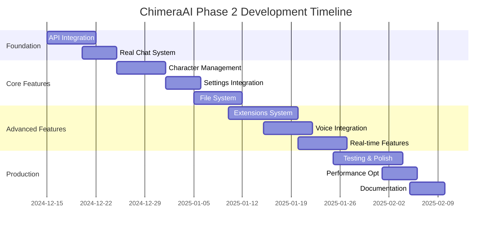

# Phase 2 - Development Roadmap

## 🎯 Phase 2 Vision

Transformasi ChimeraAI dari **beautiful prototype** menjadi **production-ready AI chat platform** dengan full backend integration dan advanced features.

## 📅 Timeline Overview



## 🏗️ Development Phases

### Phase 2.1: Backend Integration (Week 1-2)
**Goal**: Menghubungkan UI dengan SillyTavern backend secara penuh

#### 🔌 API Integration
- **Real Chat API**: Implementasi actual AI responses
- **Streaming Integration**: WebSocket untuk real-time streaming
- **Provider Management**: Dynamic AI provider switching
- **Error Handling**: Robust error management & retry logic

#### 💬 Chat System Enhancement
- **Message Processing**: Real prompt assembly & context management
- **Character Loading**: Integration dengan SillyTavern character system
- **Chat History**: Persistent storage & retrieval
- **Response Regeneration**: Actual AI regeneration functionality

### Phase 2.2: Core Features (Week 3-4)
**Goal**: Implementasi fitur-fitur inti untuk production usage

#### 🤖 Character Management
- **Character Creation**: Full character creation wizard
- **Character Import/Export**: Tavern Card format support
- **Avatar Management**: Upload, crop, dan manage character images
- **Character Templates**: Pre-built character templates
- **Character Sharing**: Export/import character definitions

#### ⚙️ Advanced Settings
- **Provider Configuration**: Multi-provider setup & switching
- **Model Selection**: Dynamic model loading per provider
- **Generation Presets**: Save/load generation setting presets
- **Context Management**: Advanced context window handling
- **Memory Management**: Conversation memory optimization

### Phase 2.3: Advanced Features (Week 5-6)
**Goal**: Menambahkan fitur-fitur advanced untuk power users

#### 🧩 Extensions System
- **Quick Reply**: Customizable quick response buttons
- **World Info/Lorebook**: Context injection system
- **Token Counter**: Real-time token counting & optimization
- **Author's Note**: Advanced prompt engineering
- **Regex Processing**: Text transformation & filtering

#### 🎤 Voice Integration  
- **Speech-to-Text**: Voice input processing
- **Text-to-Speech**: Character voice responses
- **Voice Cloning**: Custom character voices (if supported)
- **Audio Controls**: Volume, speed, voice selection

#### 📁 File System Integration
- **File Attachments**: Document, image, audio upload
- **File Processing**: OCR, transcription, analysis
- **Media Gallery**: Chat media management
- **Export Options**: Multiple export formats

### Phase 2.4: Real-time & Social Features (Week 7)
**Goal**: Real-time collaboration dan social features

#### 🔄 Real-time Features
- **Live Streaming**: Real-time response streaming
- **Typing Indicators**: Show when AI is generating
- **Live Settings Sync**: Real-time settings synchronization
- **Connection Status**: Live backend connection monitoring

#### 👥 Social Features (Optional)
- **Character Marketplace**: Share/discover characters
- **Chat Sharing**: Share interesting conversations
- **Community Templates**: Community-created content
- **User Profiles**: Basic user management

### Phase 2.5: Production Readiness (Week 8-10)
**Goal**: Production-ready deployment dengan optimization

#### 🚀 Performance Optimization
- **Bundle Splitting**: Optimal code splitting
- **Lazy Loading**: Component & route-based lazy loading  
- **Caching Strategy**: Intelligent response caching
- **Memory Optimization**: Efficient memory management
- **Background Processing**: Web Workers untuk heavy tasks

#### 🔒 Security & Reliability
- **Input Sanitization**: XSS prevention
- **Rate Limiting**: API request throttling
- **Error Recovery**: Automatic error recovery
- **Offline Mode**: Basic offline functionality
- **Data Validation**: Comprehensive input validation

#### 📊 Analytics & Monitoring
- **Usage Analytics**: User interaction tracking
- **Performance Monitoring**: Real-time performance metrics
- **Error Tracking**: Comprehensive error logging
- **A/B Testing**: Feature flag system

## 🎯 Feature Priorities

### 🔥 High Priority (Must Have)
1. **Real AI Integration**: Actual chat functionality
2. **Character System**: Full character management
3. **Streaming Support**: Real-time response streaming
4. **File Attachments**: Basic file upload support
5. **Extensions Core**: Quick Reply, World Info, Token Counter
6. **Performance**: Optimized loading & rendering

### 🟡 Medium Priority (Should Have)
1. **Voice Integration**: Speech-to-text & text-to-speech
2. **Advanced Extensions**: Author's Note, Regex, CFG
3. **Character Templates**: Pre-built & community characters
4. **Export/Import**: Data portability features
5. **Multi-Provider**: Seamless provider switching
6. **Mobile Optimization**: Enhanced mobile experience

### 🔵 Low Priority (Nice to Have)
1. **Social Features**: Character sharing, community
2. **Advanced Analytics**: Detailed usage insights
3. **Plugin System**: Third-party plugin support
4. **Theming System**: Custom theme creation
5. **API Documentation**: Auto-generated API docs
6. **Desktop App**: Electron wrapper

## 🛠️ Technical Implementation Plan

### Backend Integration Strategy
```typescript
// Phase 2.1: Real API Integration
class ChimeraAPI {
  private sillyTavernClient: SillyTavernClient;
  private streamingClient: WebSocketClient;
  
  async generateResponse(request: ChatRequest): Promise<ChatResponse> {
    // Real implementation connecting to SillyTavern
  }
  
  async streamResponse(request: ChatRequest): AsyncGenerator<string> {
    // Real-time streaming implementation
  }
}
```

### Extension Architecture
```typescript
// Phase 2.3: Extensions System
interface ChimeraExtension {
  id: string;
  name: string;
  version: string;
  
  initialize(): Promise<void>;
  processMessage?(message: IChatMessage): IChatMessage;
  renderUI?(): React.ComponentType;
  cleanup?(): Promise<void>;
}

class ExtensionManager {
  private extensions: Map<string, ChimeraExtension>;
  
  loadExtension(extension: ChimeraExtension): void;
  unloadExtension(id: string): void;
  processMessagePipeline(message: IChatMessage): IChatMessage;
}
```

### State Management Evolution
```typescript
// Enhanced Zustand store for Phase 2
interface ChimeraStore extends ChatStore {
  // Extensions
  extensions: Map<string, ChimeraExtension>;
  extensionSettings: Record<string, any>;
  
  // Advanced features
  voiceSettings: IVoiceSettings;
  fileManager: IFileManager;
  analytics: IAnalytics;
  
  // Real-time state
  connectionStatus: 'connected' | 'disconnected' | 'connecting';
  streamingStatus: 'idle' | 'streaming' | 'paused';
  
  // Advanced actions
  loadExtension: (extension: ChimeraExtension) => Promise<void>;
  processVoiceInput: (audio: Blob) => Promise<string>;
  uploadFile: (file: File) => Promise<string>;
}
```

## 📊 Success Metrics

### Technical Metrics
- **API Response Time**: < 200ms (non-streaming)
- **Streaming Latency**: < 50ms first token
- **Bundle Size**: < 500KB gzipped
- **Memory Usage**: < 100MB peak
- **Error Rate**: < 1% API calls

### User Experience Metrics
- **Time to First Message**: < 3 seconds
- **Character Load Time**: < 1 second
- **Settings Response**: < 100ms
- **File Upload Speed**: < 5 seconds for 10MB
- **Voice Recognition Accuracy**: > 95%

### Feature Completion
- **Core Chat**: 100% functional
- **Character Management**: 100% functional  
- **Extensions**: 80% of SillyTavern features
- **Voice Integration**: Basic functionality
- **Performance**: Production-ready

## 🔄 Migration Strategy

### From Phase 1 to Phase 2
```typescript
// Data migration plan
interface MigrationPlan {
  // Preserve existing data
  characters: ICharacter[];     // Keep current characters
  settings: IModelSettings;     // Preserve user settings
  theme: 'light' | 'dark';     // Maintain theme preference
  
  // Enhance existing data
  chats: IChat[];              // Migrate to new chat format
  connections: IAPIConnection[]; // Update connection format
  
  // Add new data structures
  extensions: ExtensionConfig[];
  voiceSettings: IVoiceSettings;
  analytics: IAnalyticsData;
}
```

### Backward Compatibility
- **Settings**: Automatic migration from Phase 1
- **Characters**: Full compatibility with existing characters
- **Themes**: Enhanced theme system with fallback
- **API**: Graceful degradation for unsupported features

## 🧪 Testing Strategy

### Unit Testing
```bash
# Component testing
npm run test:components

# Store testing  
npm run test:store

# API testing
npm run test:api

# Utility testing
npm run test:utils
```

### Integration Testing
```bash
# Full application flow
npm run test:e2e

# API integration
npm run test:integration

# Performance testing
npm run test:performance
```

### Manual Testing Checklist
- [ ] All Phase 1 features still work
- [ ] New features function correctly
- [ ] Performance meets targets
- [ ] Error handling works
- [ ] Mobile experience optimal
- [ ] Cross-browser compatibility

## 🚀 Deployment Strategy

### Development Environment
- **Local Development**: Vite dev server + SillyTavern
- **Testing Environment**: Docker containers
- **Staging Environment**: Production-like setup

### Production Deployment
- **Static Hosting**: Vercel/Netlify untuk frontend
- **Backend**: Self-hosted SillyTavern instance
- **CDN**: Asset delivery optimization
- **Monitoring**: Error tracking & performance monitoring

## 📋 Phase 2 Checklist

### Week 1-2: Foundation ✅
- [ ] Real API integration working
- [ ] Streaming responses functional  
- [ ] Error handling robust
- [ ] Character loading from backend
- [ ] Settings synchronization

### Week 3-4: Core Features
- [ ] Character creation wizard
- [ ] File upload system
- [ ] Advanced settings panel
- [ ] Multi-provider support
- [ ] Performance optimizations

### Week 5-6: Advanced Features  
- [ ] Extensions system functional
- [ ] Voice input/output working
- [ ] Quick Reply implemented
- [ ] World Info system active
- [ ] Token counter accurate

### Week 7: Real-time Features
- [ ] WebSocket streaming stable
- [ ] Live typing indicators
- [ ] Connection status monitoring  
- [ ] Real-time settings sync

### Week 8-10: Production Ready
- [ ] Comprehensive testing complete
- [ ] Performance targets met
- [ ] Security audit passed
- [ ] Documentation complete
- [ ] Deployment pipeline ready

---

**Phase 2 Start Date**: TBD (After Phase 1 Approval)  
**Expected Completion**: 10 weeks from start  
**Success Definition**: Production-ready AI chat platform with full SillyTavern integration